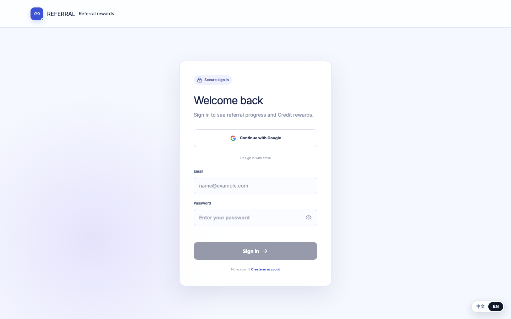
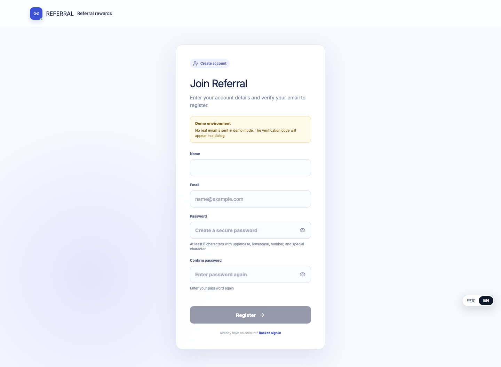
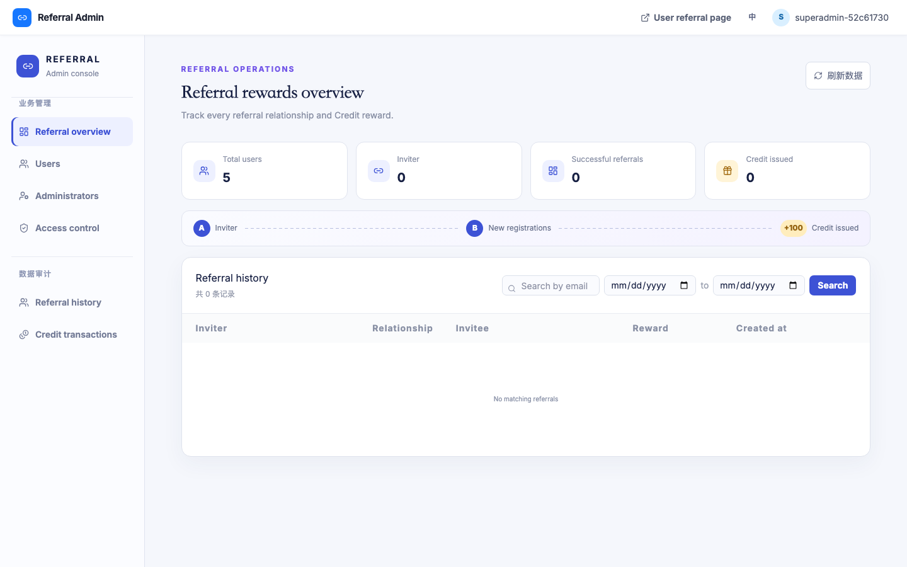

# Referral 邀请奖励系统

这是对《技术面试编程题：Referral 邀请系统》的完整实现。已有用户可以生成唯一邀请链接；新用户按题目要求仅填写姓名和邮箱接受邀请。注册成功时，系统在同一个数据库事务中创建用户与邀请关系、给邀请人增加 100 Credit，并写入不可变 Credit 流水。

## 项目结构

- `backend/`：Go、Gin、Fx、Ent、PostgreSQL、Redis，按 Controller → Service → Repository 分层。
- `frontend/apps/web/`：用户邀请工作台、独立注册登录和受邀注册页面。
- `frontend/apps/admin/`：邀请记录、Credit 流水、用户与 RBAC 管理。
- `deploy/`：PostgreSQL/Redis、本地测试容器、Nginx、systemd 原子发布脚本。

线上演示地址：<https://referral.vivl.cc/>，管理端位于 `/admin/`。

## 界面预览

| 登录 | 独立注册 |
| --- | --- |
|  |  |




## 本地运行

需要 Go 1.25+、Node.js、pnpm 和 Docker Compose。

```bash
cd backend
cp config.example.yaml config.yaml
make compose-up
go run ./cmd/migrate up
go run ./cmd/app

cd ../frontend
pnpm install
pnpm dev:web       # http://localhost:5173
pnpm dev:admin     # http://localhost:5174/admin
```

## 设计与取舍

- `users.referral_code` 唯一标识邀请人，使用密码学安全随机数生成并由唯一索引处理碰撞。
- `referrals.invitee_id` 唯一，确保一个新用户只接受一次邀请。
- `credit_transactions.referral_id` 唯一，确保一次邀请只产生一笔奖励。
- 用户、邀请关系、余额和流水在一个 PostgreSQL 事务内提交；任何一步失败都会回滚。
- 题目要求的受邀注册保持最小化，只需要姓名和邮箱；平台自己的独立注册继续使用密码和演示验证码。
- 当前奖励规则固定为 100 Credit。若继续迭代，会将奖励规则、有效期和活动配置抽成独立领域能力。

## 测试

```bash
cd backend
go test ./...
make test-integration   # 独立 PostgreSQL 18 容器，验证事务和并发奖励

cd ../frontend
pnpm typecheck
pnpm build
pnpm exec playwright install chromium
pnpm test:e2e
```

后端单元测试覆盖服务、控制器、认证、RBAC 和邀请仓储；PostgreSQL 集成测试覆盖成功注册、无效邀请码回滚和并发 Credit 累加。Playwright 覆盖受邀注册的成功、无效邀请码和重复邮箱界面契约。

## 后续工作

- 在 CI 中运行 PostgreSQL 集成测试和 Playwright E2E。
- 增加真实邮件验证码服务、限流和验证码过期策略。
- 增加 Credit 余额与流水的周期性对账。
- 将 Google OAuth Token 交换部署到可访问 Google API 的网络环境。

详细说明见 [后端文档](backend/README.md)、[前端文档](frontend/README.md) 和 [部署文档](deploy/README.md)。
